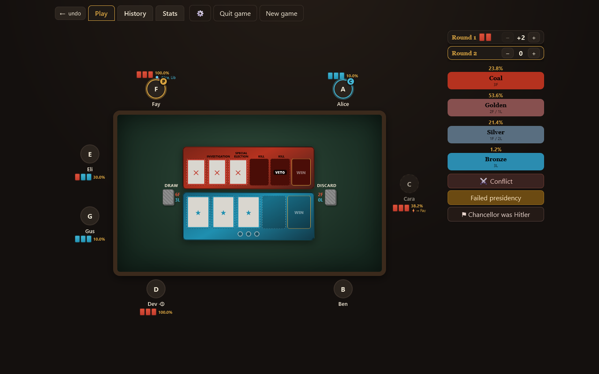
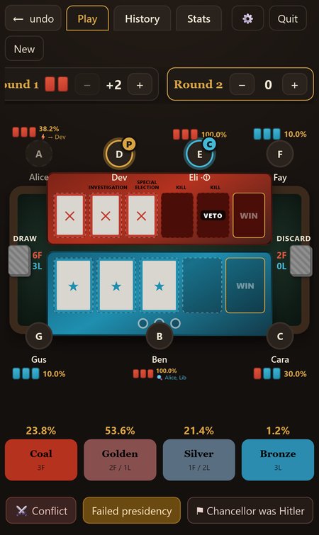
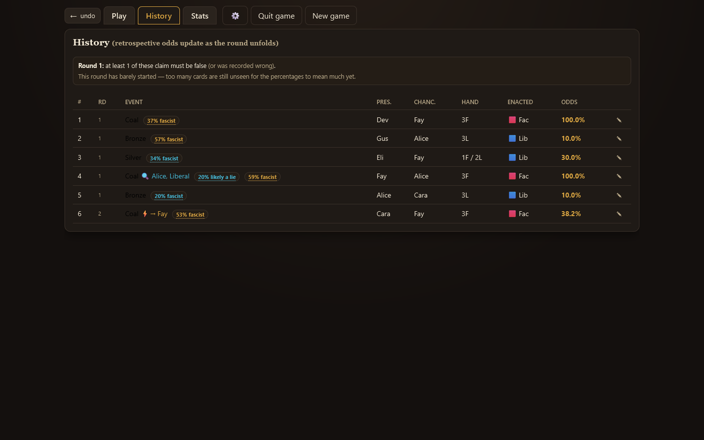

# Secret Hitler Companion

A table companion for the board game **Secret Hitler**: it seats the players, tracks every government, and shows live odds of whether each President's claim could be true. Built for a group playing in person, with a phone or laptop on the table.

**[▶ Open the live app](https://timothyhadfield.github.io/secret-hitler-companion/)** · works on phone and laptop

<p align="center">
  
  &nbsp;
  
</p>

## Features
- **Live probability**: the odds of each hand the President could have drawn, updated as the round is revealed.
- **Lie and role modeling**: flags claims that can't all be true and estimates each player's chance of being a Fascist.
- **One-tap recording**: tap the Chancellor, tap the claimed hand; the enacted policy, powers, term limits, veto and chaos are handled for you.
- **Presidential powers** (investigation, peek, special election, execution) recorded against whoever used them.
- **Statistics and replays**: per-player stats across games, and any finished game can be replayed turn by turn.
- **Optional accounts and groups** to sync games across devices and share a group's stats; it works fully offline without one.
- **"In the night" narration**, online play, and built-in Rules and Game theory handbooks.

<p align="center">
  
</p>

## Built with
Plain HTML, CSS and JavaScript with no build step, hosted on GitHub Pages; optional Firebase (Auth + Firestore, free plan) for accounts and sync.

## Full feature list
- **Randomization** — shuffles seating and picks the first President.
- **Bird's-eye table** — players seated around a rectangular table (top/bottom only on phones,
  all four sides on a laptop, never on a corner). Each President's hands, the retrospective
  odds of each, and any power outcomes are listed by their seat.
- **Boards & piles** — Fascist (6) and Liberal (5) tracks with the power markers for your
  player count, plus live draw/discard pile composition.
- **Probability** — a *retrospective* hypergeometric model: each government's odds update as
  more of the round is revealed, with the draw odds for each option shown on the buttons.
- **Lie modeling** — a per-round "liberal modifier" to explore what the numbers look like if
  Presidents lied about their discards. It is bounded to physically possible values and
  auto-adjusts if a recorded claim would otherwise be impossible.
- **Reshuffle handling** — automatically detects the round boundary (draw pile < 3), reveals
  the inferred bottom cards, and starts a fresh, independent probability round.
- **Presidential powers** — Investigation, Policy Peek, Execution and Special Election pause
  play with a prompt and are recorded against the President who used them.
- **Rules it enforces** — term limits (including the 5-players-alive exception and the chaos
  reset), veto after 5 Fascist policies, no investigating the same player twice, and correct
  presidential rotation through (even nested) Special Elections.
- **Undo & resume** — full-state undo of any action, and the in-progress game is saved locally
  so a refresh, a closed tab or a redeploy picks up exactly where you left off.
- **Statistics** — in-depth per-player and cross-game stats, plus a review of every finished game
  you can **replay turn by turn** (◀ ▶) or **delete**.
- **Lie & role modeling** (optional, in ⚙ Settings) — a per-claim honesty read in History and, in a
  finished game's review, the model's estimate of each player's chance of being Fascist/Hitler from
  play alone; a separate opt-in shows live fascist odds on the table.
- **"In the night" narration** — a start-of-game 🌙 button reads the fascist-reveal aloud (the right
  5–6 vs 7+ script is chosen automatically). Use a built-in voice or record/upload your own.
- **Accounts & groups** (optional) — sign in to sync your games across devices and share a group's
  stats; the app works fully offline and signed-out. A shared night voice syncs to your group too.
- **Play online** — host or join a live game from the main menu.
- **Rules & Game theory handbooks** — a searchable rules reference and a strategy guide with community notes.

## How to use
0. The app opens on a **main menu** — pick **Start game** (or **Statistics**). Optional: sign in from
   the profile corner to sync across devices, and tap the group box to switch groups.
1. Add 5–10 players and press **Randomize seating & start**. Before the first presidency, the **🌙**
   button can play the "in the night" fascist reveal.
2. Each round: the President is fixed (gold **P**). **Tap a player** to set the Chancellor
   (blue **C**), then **tap the hand the President claims they drew** — that submits the
   government. The enacted policy is inferred, so you're never asked for it.
   - Use **⚔ Conflict** if the Chancellor enacted a Fascist despite a claimed Liberal.
   - Use **⊘ Veto** (from 5 Fascist policies) if the government was vetoed.
   - Use **Failed presidency** for a rejected election; three in a row triggers Chaos.
3. Adjust a round's **modifier** if you suspect lies — every probability in that round updates.
4. The game ends automatically on 5 Liberal / 6 Fascist policies or an executed Hitler; press
   **⚑ Chancellor was Hitler** to declare that win yourself. Then record Hitler and the
   Fascists to save the game to your statistics.

The **←** arrow at the top-left is always the way back (labelled *undo* during play).

## Documentation
- [`SECRET_HITLER_RULES.md`](SECRET_HITLER_RULES.md) — the rules the app encodes.
- [`PROBABILITY_MODEL.md`](PROBABILITY_MODEL.md) — the math behind the probability display.
- [`PROGRESS.md`](PROGRESS.md) — current status, decisions, and roadmap.
- [`CHAT.md`](CHAT.md) — session-by-session log of changes.

## Tech
Plain static site — HTML + CSS + vanilla JavaScript, **no build step, no bundler**. Deployed via
GitHub Pages. Data lives in your browser (`localStorage`, plus IndexedDB for custom night-voice
audio); signing in adds optional **Firebase** sync (auth + Firestore, loaded from a CDN so there's
still no build step). The app works fully offline and without an account.

## Local development
Serve the folder over HTTP (needed for `localStorage`):
```bash
# any static server works, e.g.
python -m http.server 8000
# then open http://localhost:8000
```
